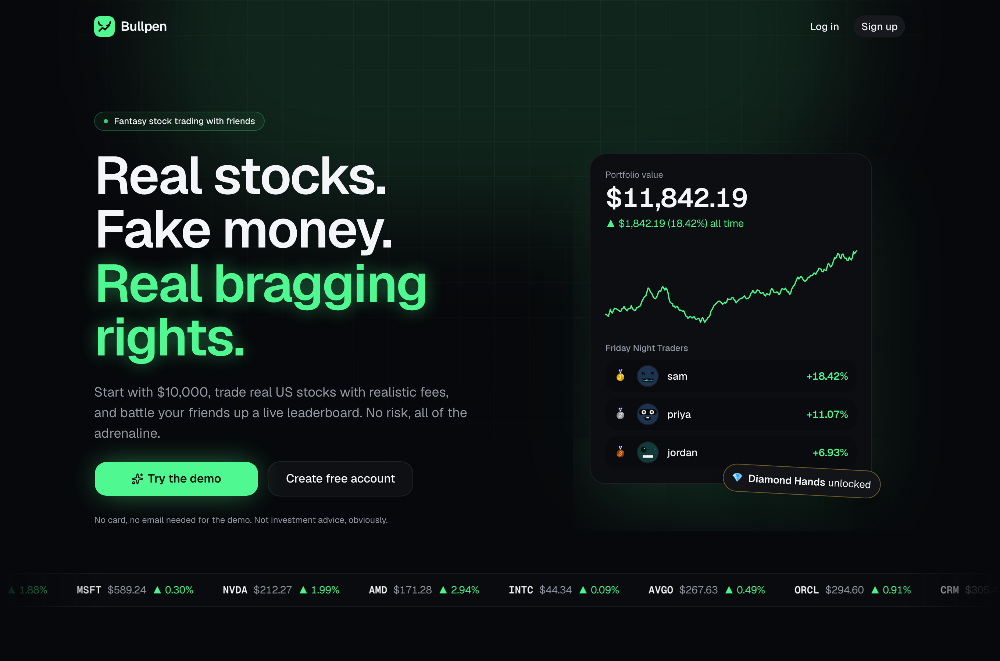
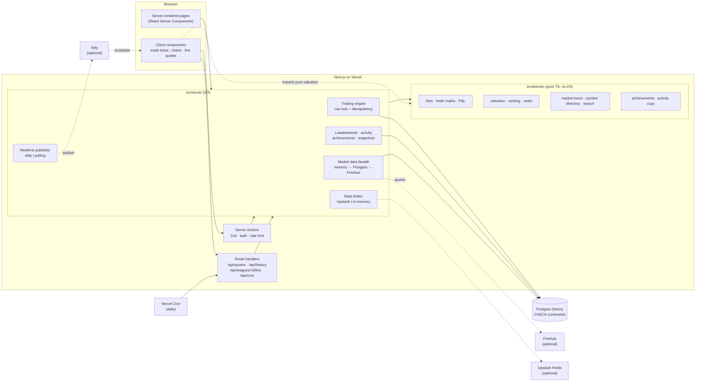
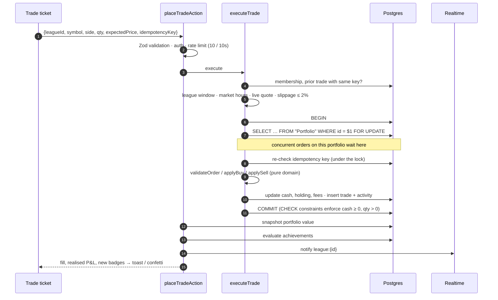

<div align="center">

# 🐂 Bullpen

**Real stocks. Fake money. Real bragging rights.**

A multiplayer paper-trading game: everyone starts with $10,000, trades real US stocks with realistic fees, and battles friends up live leaderboards.

[](https://github.com/wr7mdmf7h4-cmyk/bullpen/actions/workflows/ci.yml)


**[Live app →](https://bullpen.site)** · sign up free and get $10,000

</div>

<p align="center">
  
</p>

> Regenerate screenshots with `SCREENSHOTS=1 PLAYWRIGHT_BASE_URL=https://bullpen.site npx playwright test screenshots` (it signs up a throwaway player). A GIF of a trade + confetti makes a great addition.

---

## Features

**Trading**

- **Every US-listed stock and ETF (~12,000)**, synced from the exchanges' public symbol directory and searchable with <kbd>⌘K</kbd>; a hand-picked Popular list with sector filters, movers and sparklines
- Robinhood-style price charts (1D / 1W / 1M / 1Y): drag across the chart and the headline price scrubs with you
- Market orders with a live fee preview (**$1 flat + 0.1%**, configurable per league), a “Max” button, and a review sheet with the full fee breakdown
- **Press-and-hold to confirm**: the deliberate friction real brokers use for irreversible orders
- Validation for overspending (including fees), selling shares you don't own, fees exceeding proceeds, and a 2% slippage guard between confirm and fill
- US market hours enforced for live leagues (holidays, early closes, DST), with a countdown to the open

**Portfolio**

- Cash, holdings, average cost, unrealised/realised P&L, total return %, fees paid, sector allocation
- Value-over-time chart: snapshots on every trade + a daily cron, with the stretch since your last trade rebuilt exactly from price history
- Values tick live in the browser using the same pure valuation code as the server

**Multiplayer**

- Everyone auto-joins the **Global League**
- Private leagues with invite links: start/end dates, starting cash and fees; members can **leave** a league (ownership passes on; empty leagues are removed) and the host can **rename** it
- Live leaderboards ranked by return %, a podium, animated re-ordering and a real-time activity feed (“sam bought 20 NVDA 🚀”)

**Game layer**

- 9 achievements with toast pop-ups: First Trade, In the Green, Diamond Hands, Diversified, Fee Goblin, High Roller, Day Trader, League Founder, To the Moon
- Rank titles by return: ☕ Intern → 📊 Analyst → 📈 Trader → 🐋 Whale, with progress to the next title
- Confetti on profitable sells, green/red price flashes, pulsing live-market indicator
- Dark, neon, fully responsive: bottom tab bar and a bottom-sheet trade ticket on mobile

**Accounts**

- Email + password (argon2id), optional Google OAuth, username onboarding, generated avatars (DiceBear, rendered locally)
- Public profile pages with stats, standings in every league, badges and trade history
- Each account remembers which league it's viewing (on every device), defaulting to the one used most recently

**Admin**

- `/admin`, visible only to the emails in `ADMIN_EMAILS` (a 404 for everyone else): players, sign-ups (24h / 7d / 30d and a 30-day chart), who's online now, active users, latest trades and a searchable player list, refreshing itself every 10 seconds
- Moderation from `/admin`: remove a player (typed-username confirmation; their leagues pass to the next member or are deleted when empty) or delete a private league

---

## Architecture



### What happens when you press “Hold to buy”



### Project structure

```
src/
├─ domain/            Pure TypeScript business logic: no I/O, ~95% line coverage
│  ├─ money.ts        integer cents, basis points, exact BigInt mul/div, formatting
│  ├─ fees.ts         flat + bps fee model
│  ├─ trading.ts      quote/validate orders, cost basis, realised P&L, max shares, slippage
│  ├─ portfolio.ts    valuation, weights, sector allocation (runs on server AND client)
│  ├─ leaderboard.ts  ranking with ties
│  ├─ ranks.ts        Intern → Whale
│  ├─ achievements.ts badge definitions + unlock rules
│  ├─ activity.ts     feed payload schema + copy
│  ├─ leagues.ts      league lifecycle, invite codes
│  └─ market/         NYSE calendar, symbol-directory parser, search, sectors, dev-only fake market
├─ server/            Everything with side effects (all `server-only`)
│  ├─ trading/        executeTrade: the transactional engine
│  ├─ market/         Finnhub client + cached market data facade
│  ├─ instruments.ts  in-memory universe (~12k symbols), search, sector enrichment
│  ├─ leagues/        membership, active league, create/join, tradability
│  ├─ actions/        Server Actions (the only write entry points)
│  ├─ auth/           Auth.js config, argon2id
│  ├─ portfolio.ts    valuation at live prices, snapshots, history
│  ├─ leaderboard.ts  leaderboards + activity feed
│  ├─ achievements.ts aggregate queries → domain rules → awards
│  ├─ realtime.ts     Ably | polling behind one interface
│  └─ rate-limit.ts   Upstash | in-memory behind one interface
├─ app/               Routes (thin): (auth), (game), join/, api/
├─ components/        UI: market, trade, portfolio, league, achievements, shell, ui (shadcn)
├─ hooks/             useLiveQuotes, useLeagueLive
└─ lib/               Zod schemas, serialisation, small client helpers
prisma/               schema, migrations (incl. raw-SQL CHECK constraints)
tests/                integration (real Postgres) and e2e (Playwright)
```

---

## Key technical decisions

### Money is integer cents, never floats

Every amount is an integer number of cents and every percentage is integer basis points. Multiplication and division go through `mulDivRound` (BigInt, explicit half-up rounding), so products can never lose precision. Dollars from the Finnhub API are converted to cents **once**, at the boundary. Prices are whole cents, shares are whole numbers.

### Trades are atomic, serialised and idempotent

- **Row lock.** Each trade runs in one transaction that begins with `SELECT … FOR UPDATE` on the portfolio row, so concurrent orders on the same portfolio execute one after another against fresh balances. An integration test fires 8 simultaneous buys at a portfolio that can afford 2: exactly 2 fill, 6 are rejected, and the ledger balances. With the lock removed, that test fails.
- **Idempotency key.** The client mints a UUID per order review. The key is checked _under the lock_ and backed by a unique index, so a double-click or network retry returns the original fill instead of trading twice.
- **Slippage guard.** The order carries the price the user confirmed; if the executable price moved more than 2% the order is rejected and the confirm sheet updates to the new price.
- **CHECK constraints.** A raw-SQL migration adds `cash_cents >= 0`, `quantity > 0`, `price > 0`, `fee >= 0` and date-order checks. Even a bug in application code can't commit an impossible balance.
- **Ledger invariant.** Trades are an immutable ledger; `cash = starting cash + Σ netCash` always holds (verified in tests).

### Real data only

Every price a player sees or trades at is real:

- **Quotes** come from Finnhub through a two-tier cache (memory → Postgres `QuoteCache` → API) that keeps the app inside the free tier's 60 calls/minute: a priority-aware per-instance budget (the stock you're viewing and orders you place always get a fresh price; list refreshes are capped), a 60s TTL while the market is open, and a 30s back-off after an HTTP 429.
- **No invented prices.** If a fresh quote can't be had, the app shows the last real price it saw, or "price unavailable". Orders only fill against a fresh quote (`isExecutableQuote`), so a stale price can't be exploited.
- **Real market hours.** Orders fill 9:30am–4pm ET on trading days (NYSE holidays, early closes and DST handled in pure TypeScript); outside those hours you can browse, with a countdown to the open.
- **Price history is real, never generated.** With `TWELVE_DATA_API_KEY`, the first time anyone opens a stock's chart its real history is downloaded (5 years of daily closes, plus 5-minute bars for the last week) into `PriceSample`, then only the gap is topped up; unfinished bars are skipped so a partial day is never stored as a close. Every live Finnhub quote is recorded into the same table, plus a daily close job. Without the key, charts show only what Bullpen has recorded itself and fill in over time. Portfolio charts use recorded values only: a snapshot on every trade, on views (at most every 15 minutes) and daily.
- **Development and tests** can opt into a deterministic fake market with `FAKE_MARKET_DATA=1` (a pure function of symbol and time, so tests are reproducible). Production ignores it.

### Optional integrations

| Concern                     | With the env var                                                                      | Without it                              |
| --------------------------- | ------------------------------------------------------------------------------------- | --------------------------------------- |
| Prices (`FINNHUB_API_KEY`)  | Real quotes, fundamentals and recorded history                                        | **Required for real prices**            |
| Realtime (`ABLY_API_KEY`)   | Ably push: server publishes invalidation events, browser holds a subscribe-only token | Polling every 10s                       |
| Rate limiting (`UPSTASH_*`) | Sliding window in Redis, correct across instances                                     | Fixed window in memory per instance     |
| Google sign-in (`GOOGLE_*`) | Google button + username onboarding                                                   | Email/password only                     |
| Cron (`CRON_SECRET`)        | Daily closes, snapshots, weekly stock-list refresh via Vercel Cron                    | Trades and views still record snapshots |

Realtime messages are **invalidations, not data** (“league X changed, refetch”). The browser always reads through the same authorised endpoint, so nothing private is broadcast and push and polling share one code path.

### Three layers, enforced by imports

`src/domain` never imports from `server` or `app`, and has no I/O; that's why it can be unit-tested exhaustively and also run in the browser (live portfolio valuation reuses `valuePortfolio`). `src/server` modules import `server-only`, so they can't leak into a client bundle. Server Actions are the only write entry points and all validate input with Zod.

### Other decisions and trade-offs

- **The whole US market, kept cheap.** The universe (~12k symbols) is synced from the NASDAQ Trader symbol directory, which lists every NASDAQ/NYSE/Arca/Cboe security. A pure parser keeps common stock, ADRs, share classes (BRK.B), MLP units and ETFs, and drops warrants, rights, SPAC units, preferreds and notes. Each server instance holds the universe in memory (~12k small rows), so lookups and search are effectively free. Quotes are fetched only for symbols someone is looking at or holds, so the free Finnhub tier still works. Sectors for non-curated stocks are filled in from Finnhub's company profile the first time someone opens the page. Symbols that disappear from the directory are marked delisted: still held and valued, no longer tradable. The sync runs on every deploy and weekly from the cron.
- **Auth.js with JWT sessions and no database adapter.** Credentials require JWTs anyway; Google users are matched to accounts by _verified_ email. The JWT only carries the user id.
- **Achievements live in code**, the database only stores `(user, key, unlockedAt)`. Adding a badge needs no migration. Time-based badges (Diamond Hands) are also evaluated on dashboard visits.
- **Leaderboards are computed on read** (value every portfolio at current prices, cached for a few seconds). Simple and always consistent at this scale; see “What I'd build next”.
- **Market orders only, whole shares only**, per the brief; the schema and engine are shaped so limit orders slot in (see below).
- **Portfolio history** uses snapshots before the last trade and an exact reconstruction (cash + Σ qty × price(t)) after it, so charts are smooth and truthful without writing a snapshot every minute.
- **Design research.** The UI follows patterns from Robinhood, Trading 212 and published trading-app UX guidance: dark-first, one big number with the chart directly beneath, a single line chart coloured by direction, gains/losses always paired with ▲/▼ (not colour alone), fees shown before confirmation, and press-and-hold friction on irreversible orders.

---

## Running locally

Requirements: Node 22+ (24 recommended) and a Postgres database (a free [Neon](https://neon.tech) project works well).

```bash
git clone https://github.com/wr7mdmf7h4-cmyk/bullpen.git
cd bullpen
npm install                  # also runs `prisma generate`
cp .env.example .env         # then set DATABASE_URL and AUTH_SECRET
npm run db:migrate           # applies migrations incl. CHECK constraints
npm run instruments:sync     # loads every US-listed stock & ETF (~12k, takes a few seconds)
npm run dev
```

Open http://localhost:3000 and sign up. Set `FINNHUB_API_KEY` for real prices, or `FAKE_MARKET_DATA=1` to develop offline with deterministic fake prices.

### Environment variables

| Variable                                              | Required | Purpose                                                       |
| ----------------------------------------------------- | -------- | ------------------------------------------------------------- |
| `DATABASE_URL`                                        | ✅       | Postgres connection string (Neon pooled URL)                  |
| `AUTH_SECRET`                                         | ✅       | Signs session JWTs: `openssl rand -base64 32`                 |
| `DIRECT_URL`                                          |          | Non-pooled URL for migrations (falls back to `DATABASE_URL`)  |
| `GOOGLE_CLIENT_ID` / `GOOGLE_CLIENT_SECRET`           |          | Enables Google sign-in                                        |
| `FINNHUB_API_KEY`                                     |          | Real-time quotes for LIVE leagues                             |
| `ABLY_API_KEY`                                        |          | Push updates instead of polling                               |
| `UPSTASH_REDIS_REST_URL` / `UPSTASH_REDIS_REST_TOKEN` |          | Distributed rate limiting                                     |
| `CRON_SECRET`                                         |          | Protects the daily snapshot cron                              |
| `ADMIN_EMAILS`                                        |          | Comma-separated emails allowed into `/admin` (unset = nobody) |
| `TEST_DATABASE_URL`                                   | tests    | Disposable database for integration tests (it gets truncated) |

Every variable is documented in [`.env.example`](.env.example).

### Scripts

| Command                                 | What it does                                                                         |
| --------------------------------------- | ------------------------------------------------------------------------------------ |
| `npm run dev` / `build` / `start`       | Next.js                                                                              |
| `npm run lint` · `typecheck` · `format` | ESLint · `tsc` · Prettier                                                            |
| `npm test`                              | Vitest unit tests for `src/domain`                                                   |
| `npm run test:integration`              | Concurrency/idempotency/constraint tests against real Postgres (`TEST_DATABASE_URL`) |
| `npm run test:e2e`                      | Playwright: sign up → buy → portfolio, typo search, profile, create & leave a league |
| `npm run db:migrate` · `db:reset`       | Prisma                                                                               |

## Testing

- **Unit (Vitest):** every module in `src/domain`: fee rounding, order validation, pro-rata cost basis, realised P&L, max affordable shares, valuation, tie-aware ranking, achievement thresholds, rank titles, NYSE hours across DST/holidays/early closes, the dev/test fake market (deterministic, tick-stable, bounded), the exchange symbol-directory parser (what counts as a buyable stock), industry→sector mapping, search ranking, and the never-fill-at-a-fake-price rule.
- **Integration (real Postgres):** any listed symbol can be traded while unknown or delisted ones are refused, simultaneous buys can't overspend, simultaneous sells can't oversell, a triple-submitted idempotency key produces one trade, CHECK constraints reject negative cash, and trading before a league starts is refused.
- **End-to-end (Playwright):** the core loop in a real browser, including press-and-hold.
- **CI (GitHub Actions):** lint, formatting, type-check and unit tests on every push; integration tests against a Postgres service container.

## Deploying (Vercel + Neon)

Full click-by-click guide: **[docs/DEPLOYING.md](docs/DEPLOYING.md)**. The short version:

1. Import the repo in Vercel and add `AUTH_SECRET`, `CRON_SECRET` (and `FINNHUB_API_KEY`).
2. In the project's **Storage** tab, create a **Neon** database and connect it (this injects `DATABASE_URL` / `DATABASE_URL_UNPOOLED`).
3. Redeploy. `scripts/vercel-build.sh` applies migrations, syncs ~12k stocks, then builds. The daily cron records closing prices, takes snapshots and refreshes the stock list weekly.

---

## What I'd build next

- **Limit and stop orders.** Add an `Order` table (intent) alongside `Trade` (fills), reserve cash/shares on placement, and match pending orders when quotes refresh plus a scheduled sweep.
- **Fractional shares.** Move quantities to fixed-point (e.g. micro-shares as integers) and extend the domain maths; the cents/bps discipline already makes this mechanical.
- **Daily/weekly challenges and streaks.** Deterministic challenge rotation seeded by date, with progress rows per user and period.
- **Materialised leaderboards.** Precompute league standings from snapshots on a schedule (or incrementally on trade) instead of valuing every portfolio on read.
- **Candlestick view and volume** on top of the backfilled history.
- **Social layer:** comments and reactions on feed items, head-to-head challenges, end-of-league recap cards to share.
- **Observability:** structured logging, Sentry, and alerts on trade failures or quote-provider errors.
- **OTC and international listings**, plus richer metadata (logos, market cap, descriptions) cached from the data provider.
- **A paid or batch quote source** so leaderboards with thousands of distinct holdings don't lean on the free tier's 60 calls/minute.

---

Built with Next.js 16 (App Router), TypeScript, Tailwind CSS v4, shadcn/ui, Motion (formerly Framer Motion), Recharts, Prisma 7, PostgreSQL, Auth.js v5, Zod, Vitest and Playwright.

_Bullpen is a game played with real market prices and fake money. Nothing here is financial advice._
